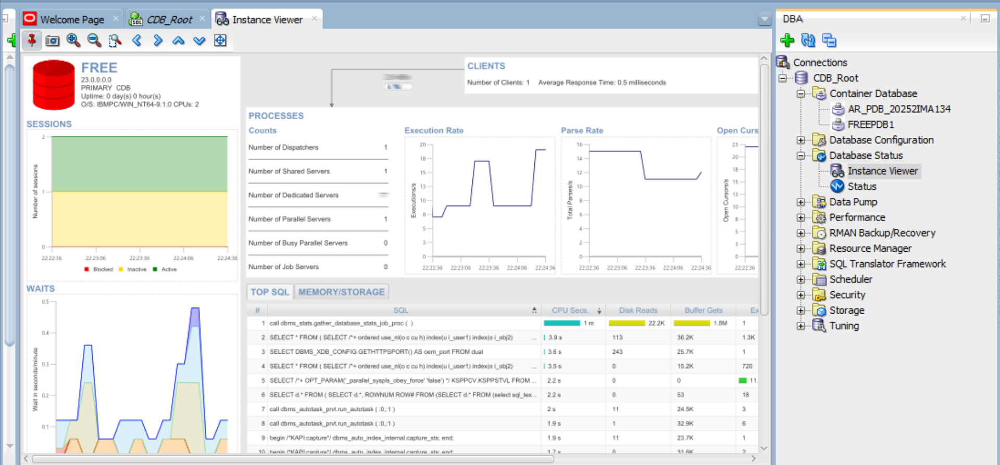

# 🗄️ Oracle Pluggable Database (PDB) Management — Assignment II

<table>
  <tr><td><strong>Student</strong></td><td>MUSAFIRI Arnold</td></tr>
  <tr><td><strong>Student ID</strong></td><td>20252IMA134</td></tr>
  <tr><td><strong>Course</strong></td><td>Database Development with PL/SQL (INSY 8311)</td></tr>
  <tr><td><strong>Instructor</strong></td><td>Eric Maniraguha</td></tr>
  <tr><td><strong>Teaching Assistant</strong></td><td>Afanyu Emmanuel</td></tr>
  <tr><td><strong>Institution</strong></td><td>Adventist University of Central Africa (AUCA)</td></tr>
</table>

---

## 📖 Overview

This repository documents my practical work on **Oracle Multitenant Architecture**, specifically focusing on:

- **Creating** a Pluggable Database (PDB) from the Container Database (CDB)
- **Managing users** within a PDB
- **Creating and deleting** a temporary PDB for lifecycle demonstration
- **Using Oracle Enterprise Manager (OEM)** to monitor the database environment

All tasks were performed individually using **Oracle SQL Developer (Version 26.2.0.186.2220)** connected to an Oracle Database instance.

---

## 🖥️ Oracle Environment

| Component               | Details                                  |
|--------------------------|------------------------------------------|
| **Database Client**      | Oracle SQL Developer 26.2.0.186.2220     |
| **Oracle Database**      | Oracle Database 23ai Free                |
| **Operating System**     | Windows                                  |
| **Architecture**         | Oracle Multitenant (CDB + PDB)           |
| **OEM**                  | Oracle Enterprise Manager Database Express |

---

## ✅ Task 1: Create a New Pluggable Database

### Objective
Create a new Pluggable Database and a user account inside it that will be reused for all future class work.

### Naming Conventions Used

| Item              | Format Applied                          | Value                              |
|-------------------|-----------------------------------------|------------------------------------|
| **PDB Name**      | FirstTwoLettersOfFirstName_pdb_StudentID | `ar_pdb_20252IMA134`              |
| **Username**      | FirstName_plsqlauca_StudentID           | `arnold_plsqlauca_20252IMA134`    |
| **Password**      | Self-chosen (not disclosed)             | ••••••••                           |

### Steps Performed

1. **Connected to CDB Root** as `SYS` with `SYSDBA` role
2. **Created the PDB** using `CREATE PLUGGABLE DATABASE` command
3. **Opened the PDB** and saved its state for automatic startup
4. **Switched session** into the new PDB
5. **Created the user** with appropriate privileges (`CREATE SESSION`, `CREATE TABLE`, `CREATE VIEW`, `CREATE SEQUENCE`, `CREATE PROCEDURE`)
6. **Verified** the PDB is in `READ WRITE` mode and the user is active

### Evidence

| Step | Description | Screenshot |
|---|---|---|
| 1 | **PDB Creation Command & Output** |  |
| 2 | **PDB Altered** |  |
| 3 | **PDB Save State** |  |
| 4 | **PDB Open in READ WRITE Mode** |  |
| 5 | **User Arnold Created** |  |
| 6 | **Grant Privileges & Quota** |  |
| 7 | **User Status Verified OPEN** |  |

---

## ✅ Task 2: Create and Delete a Temporary PDB

### Objective
Demonstrate the full PDB lifecycle by creating a temporary PDB, verifying its existence, and then completely removing it.

### Naming Convention Used

| Item                  | Format Applied                                             | Value                                   |
|-----------------------|------------------------------------------------------------|-----------------------------------------|
| **Temporary PDB Name** | FirstTwoLettersOfFirstName_to_delete_pdb_StudentID        | `ar_to_delete_pdb_20252IMA134`          |

### Steps Performed

1. **Connected to CDB Root** as `SYS` with `SYSDBA` role
2. **Created the temporary PDB**
3. **Verified the PDB exists** by querying `v$pdbs`
4. **Closed the PDB** (required before dropping)
5. **Dropped the PDB** including all data files
6. **Confirmed deletion** — query returns no rows

### Evidence

| Step | Description | Screenshot |
|---|---|---|
| 1 | **Temporary PDB Creation** |  |
| 2 | **Verify Temporary PDB Exists** |  |
| 3 | **Drop Temporary PDB** |  |
| 4 | **Confirmation (No Rows Selected)** |  |

---

## ✅ Task 3: Oracle Enterprise Manager (OEM)

### Objective
Access Oracle Enterprise Manager and capture the dashboard reflecting the Oracle environment and completed PDB tasks.

### OEM Details

| Item              | Details                                          |
|-------------------|--------------------------------------------------|
| **Dashboard**     | Oracle Database Administration (Instance Viewer) |
| **Monitored DB**  | `FREE` 23.0.0.0.0 (Primary CDB)                  |
| **Connection**    | `CDB_Root` as SYSDBA                             |
| **Visible PDB**   | `AR_PDB_20252IMA134` (under Container Database)  |

### What the Dashboard Shows
- Oracle database instance status (`FREE` Primary CDB 23c)
- Performance metrics: Sessions, Waits, Execution Rate, Top SQL, Memory/Storage
- PDB containers managed under CDB showing **`AR_PDB_20252IMA134`**
- Active administrator session

### Evidence

| Step | Description | Screenshot |
|---|---|---|
| 1 | **Database Administration Dashboard (Instance Viewer)** Reflects database metrics, active session, and created container **`AR_PDB_20252IMA134`** |  |
| 2 | **OEM Port Configuration via PL/SQL (5500)** |  |

---

## 🧩 Challenges Faced

| # | Challenge                                        | Resolution                                                   |
|---|--------------------------------------------------|--------------------------------------------------------------|
| 1 | `ORA-65016: FILE_NAME_CONVERT must be specified` | Checked seed datafiles with `con_id = 2` and supplied explicit `FILE_NAME_CONVERT` mapping for seed to new PDB directories. |
| 2 | Ensuring strict naming conventions               | Used `ar_pdb_20252IMA134`, `arnold_plsqlauca_20252IMA134`, and `ar_to_delete_pdb_20252IMA134` as strictly specified. |
| 3 | Switching containers                             | Used `ALTER SESSION SET CONTAINER` to navigate between `CDB$ROOT` and PDBs. |
| 4 | OEM Express in Oracle 23ai                       | Configured HTTPS port 5500 via `DBMS_XDB_CONFIG.SETHTTPSPORT(5500)`; noted that in Oracle 23ai Free, legacy EM Express is replaced by ORDS / Database Actions. |

---

