# 🗄️ Oracle Pluggable Database (PDB) Management — Assignment II

<table>
  <tr><td><strong>Student</strong></td><td>MUSAFIRI Arnold</td></tr>
  <tr><td><strong>Student ID</strong></td><td>20252IMA134</td></tr>
  <tr><td><strong>Course</strong></td><td>Database Development with PL/SQL (INSY 8311)</td></tr>
  <tr><td><strong>Instructor</strong></td><td>Eric Maniraguha</td></tr>
  <tr><td><strong>Teaching Assistant</strong></td><td>Afanyu Emmanuel</td></tr>
  <tr><td><strong>Institution</strong></td><td>Adventist University of Central Africa (AUCA)</td></tr>
</table>

---

## 📖 Overview

This repository documents my practical work on **Oracle Multitenant Architecture**, specifically focusing on:

- **Creating** a Pluggable Database (PDB) from the Container Database (CDB)
- **Managing users** within a PDB
- **Creating and deleting** a temporary PDB for lifecycle demonstration
- **Using Oracle Enterprise Manager (OEM)** to monitor the database environment

All tasks were performed individually using **Oracle SQL Developer (Version 26.2.0.186.2220)** connected to an Oracle Database instance.

---

## 🖥️ Oracle Environment

| Component               | Details                                  |
|--------------------------|------------------------------------------|
| **Database Client**      | Oracle SQL Developer 26.2.0.186.2220     |
| **Oracle Database**      | Oracle Database 23ai Free                |
| **Operating System**     | Windows                                  |
| **Architecture**         | Oracle Multitenant (CDB + PDB)           |
| **OEM**                  | Oracle Enterprise Manager Database Express |

---

## ✅ Task 1: Create a New Pluggable Database

### Objective
Create a new Pluggable Database and a user account inside it that will be reused for all future class work.

### Naming Conventions Used

| Item              | Format Applied                          | Value                              |
|-------------------|-----------------------------------------|------------------------------------|
| **PDB Name**      | FirstTwoLettersOfFirstName_pdb_StudentID | `ar_pdb_20252IMA134`              |
| **Username**      | FirstName_plsqlauca_StudentID           | `arnold_plsqlauca_20252IMA134`    |
| **Password**      | Self-chosen (not disclosed)             | ••••••••                           |

### Steps Performed

1. **Connected to CDB Root** as `SYS` with `SYSDBA` role
2. **Created the PDB** using `CREATE PLUGGABLE DATABASE` command
3. **Opened the PDB** and saved its state for automatic startup
4. **Switched session** into the new PDB
5. **Created the user** with appropriate privileges (`CREATE SESSION`, `CREATE TABLE`, `CREATE VIEW`, `CREATE SEQUENCE`, `CREATE PROCEDURE`)
6. **Verified** the PDB is in `READ WRITE` mode and the user is active

### SQL Commands Executed

```sql
-- Step 1: Create the PDB from CDB root
CREATE PLUGGABLE DATABASE ar_pdb_20252IMA134
  ADMIN USER pdbadmin IDENTIFIED BY "YourPassword";

-- Step 2: Open the PDB
ALTER PLUGGABLE DATABASE ar_pdb_20252IMA134 OPEN;
ALTER PLUGGABLE DATABASE ar_pdb_20252IMA134 SAVE STATE;

-- Step 3: Verify PDB is open
SELECT name, open_mode FROM v$pdbs WHERE name = 'AR_PDB_20252IMA134';

-- Step 4: Switch into the PDB
ALTER SESSION SET CONTAINER = ar_pdb_20252IMA134;

-- Step 5: Create the user
CREATE USER arnold_plsqlauca_20252IMA134
  IDENTIFIED BY "YourPassword";

GRANT CREATE SESSION, CREATE TABLE, CREATE VIEW, CREATE SEQUENCE, CREATE PROCEDURE
  TO arnold_plsqlauca_20252IMA134;

ALTER USER arnold_plsqlauca_20252IMA134 QUOTA UNLIMITED ON USERS;

-- Step 6: Verify user creation
SELECT username, account_status FROM dba_users
WHERE username = 'ARNOLD_PLSQLAUCA_20252IMA134';
```

### Evidence

| Step | Description | Screenshot |
|---|---|---|
| 1 | **PDB Creation Command & Output** | 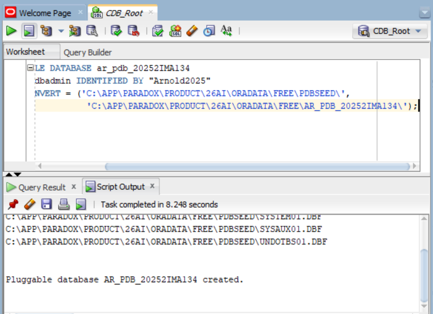 |
| 2 | **PDB Altered** | 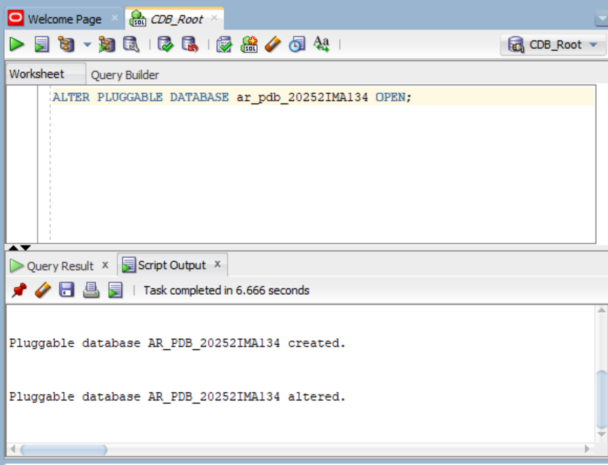 |
| 3 | **PDB Save State** | 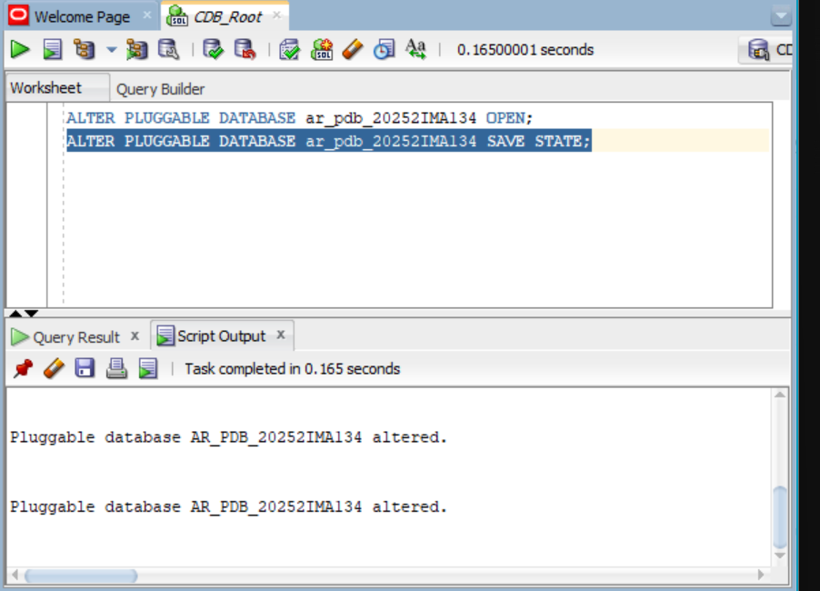 |
| 4 | **PDB Open in READ WRITE Mode** | 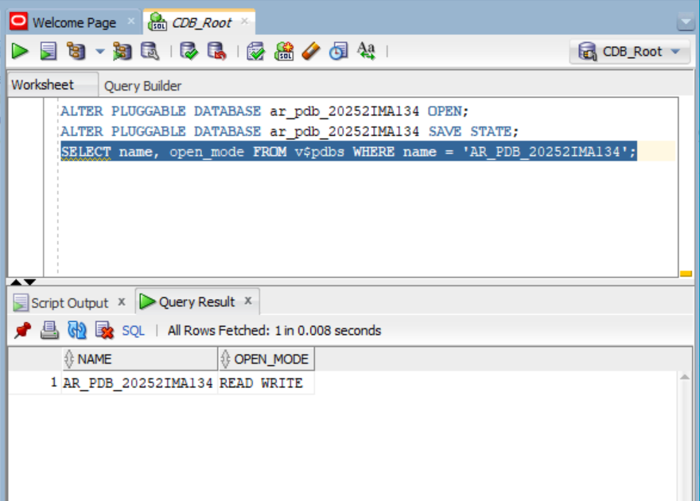 |
| 5 | **User Arnold Created** | 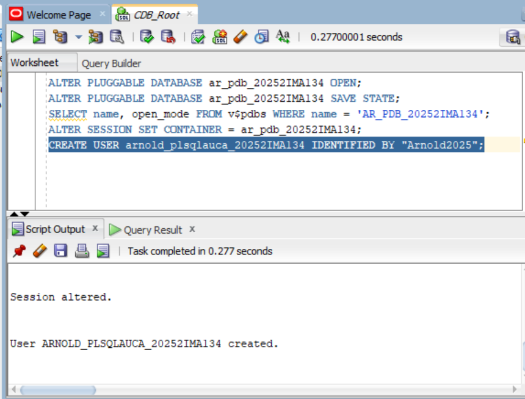 |
| 6 | **Grant Privileges & Quota** | 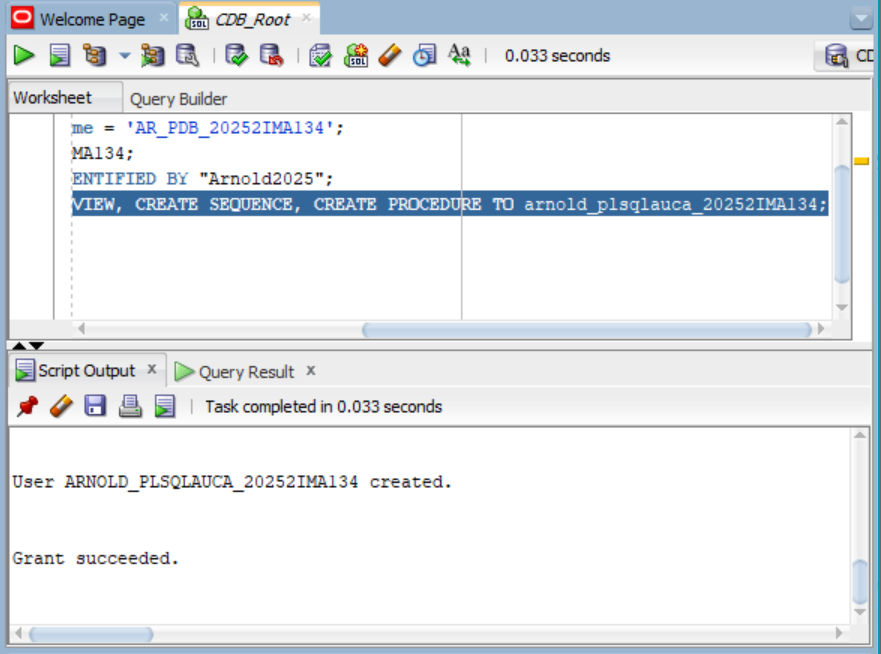 |
| 7 | **User Status Verified OPEN** | 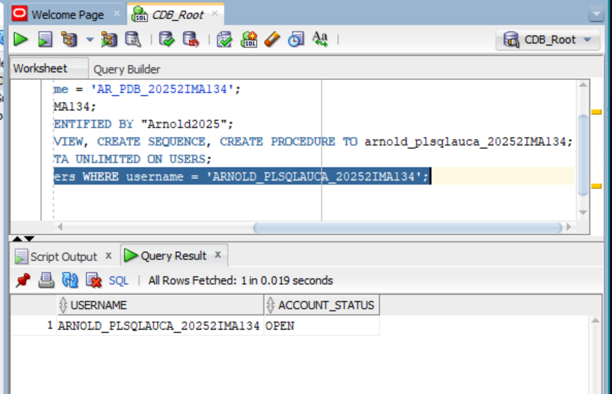 |

---

## ✅ Task 2: Create and Delete a Temporary PDB

### Objective
Demonstrate the full PDB lifecycle by creating a temporary PDB, verifying its existence, and then completely removing it.

### Naming Convention Used

| Item                  | Format Applied                                             | Value                                   |
|-----------------------|------------------------------------------------------------|-----------------------------------------|
| **Temporary PDB Name** | FirstTwoLettersOfFirstName_to_delete_pdb_StudentID        | `ar_to_delete_pdb_20252IMA134`          |

### Steps Performed

1. **Connected to CDB Root** as `SYS` with `SYSDBA` role
2. **Created the temporary PDB**
3. **Verified the PDB exists** by querying `v$pdbs`
4. **Closed the PDB** (required before dropping)
5. **Dropped the PDB** including all data files
6. **Confirmed deletion** — query returns no rows

### SQL Commands Executed

```sql
-- Step 1: Create the temporary PDB
CREATE PLUGGABLE DATABASE ar_to_delete_pdb_20252IMA134
  ADMIN USER tempadmin IDENTIFIED BY "Temp2025"
  FILE_NAME_CONVERT = ('C:\APP\PARADOX\PRODUCT\26AI\ORADATA\FREE\PDBSEED\',
                        'C:\APP\PARADOX\PRODUCT\26AI\ORADATA\FREE\AR_TO_DELETE_PDB_20252IMA134\');

-- Step 2: Verify the PDB exists
SELECT name, open_mode FROM v$pdbs
WHERE name = 'AR_TO_DELETE_PDB_20252IMA134';

-- Step 3: Close the PDB before deletion
ALTER PLUGGABLE DATABASE ar_to_delete_pdb_20252IMA134 CLOSE IMMEDIATE;

-- Step 4: Drop the PDB including datafiles
DROP PLUGGABLE DATABASE ar_to_delete_pdb_20252IMA134 INCLUDING DATAFILES;

-- Step 5: Confirm the PDB no longer exists (should return no rows)
SELECT name FROM v$pdbs
WHERE name = 'AR_TO_DELETE_PDB_20252IMA134';
```

### Evidence

| Step | Description | Screenshot |
|---|---|---|
| 1 | **Temporary PDB Creation** | 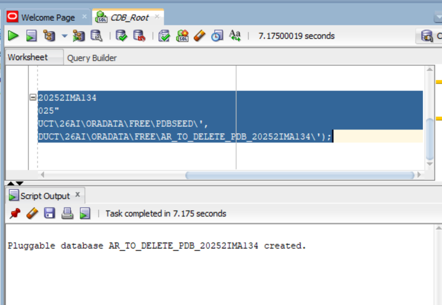 |
| 2 | **Verify Temporary PDB Exists** | 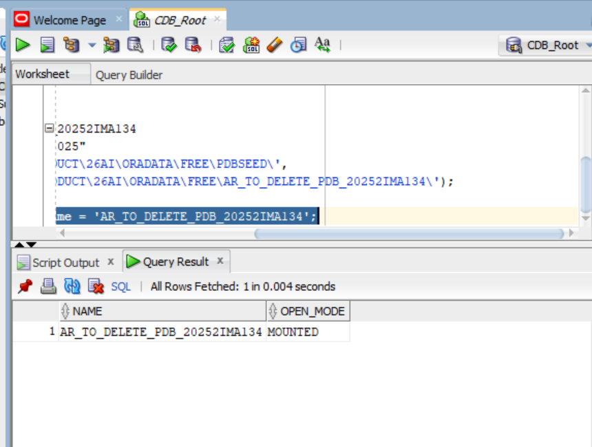 |
| 3 | **Drop Temporary PDB** | 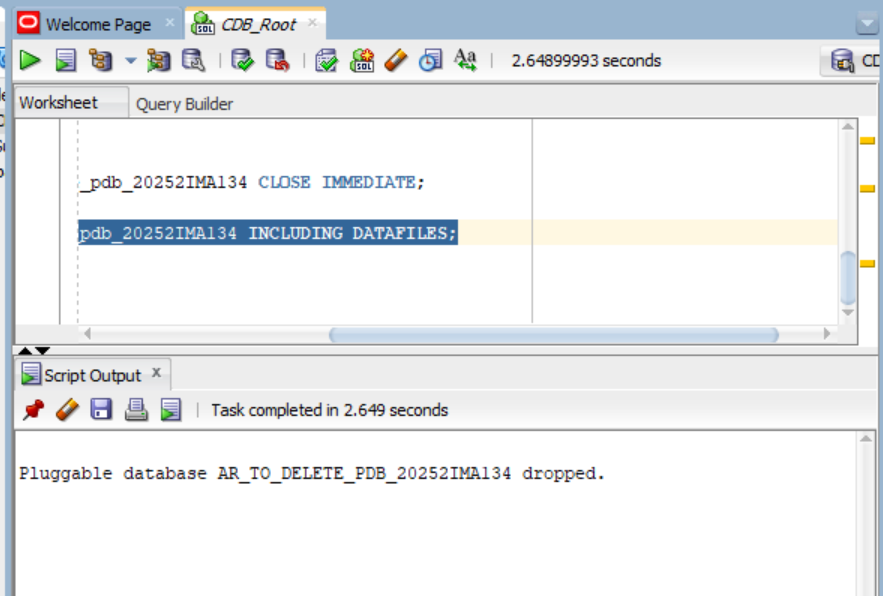 |
| 4 | **Confirmation (No Rows Selected)** | 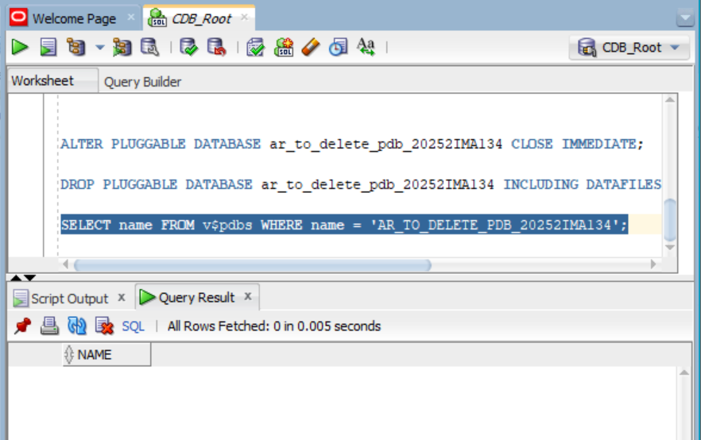 |

---

## ✅ Task 3: Oracle Enterprise Manager (OEM)

### Objective
Access Oracle Enterprise Manager and capture the dashboard reflecting the Oracle environment and completed PDB tasks.

### OEM Details

| Item              | Details                                          |
|-------------------|--------------------------------------------------|
| **OEM Product**   | Oracle Enterprise Manager Database Express       |
| **Access URL**    | `https://localhost:5500/em` (or your OEM URL)    |
| **Login User**    | SYS as SYSDBA                                    |

### What the Dashboard Shows
- Oracle database instance status
- PDB containers managed under the CDB
- Performance metrics and resource usage
- Username visible on the dashboard

### Evidence

| Step | Description | Screenshot |
|---|---|---|
| 1 | **OEM HTTPS Port Configuration (5500)** | 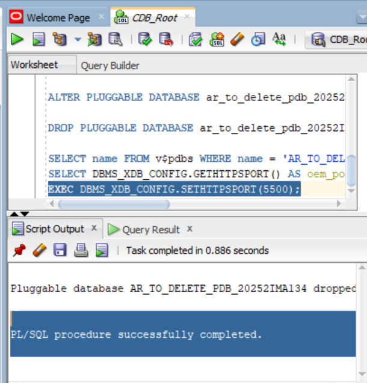 |
| 2 | **OEM Browser Access Attempt (`https://localhost:5500/em`)** | 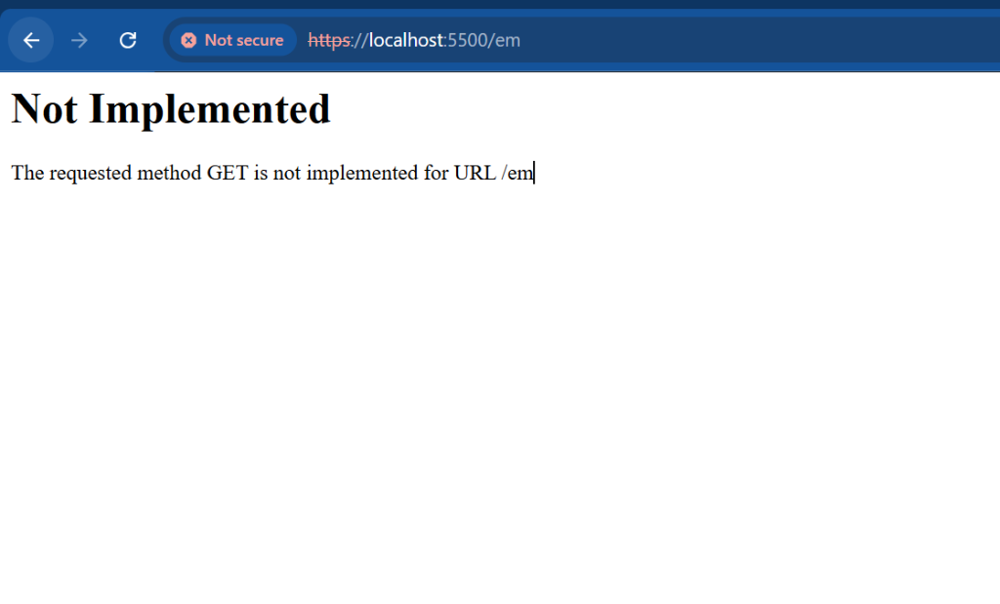 |

---

## 🧩 Challenges Faced

| # | Challenge                                        | Resolution                                                   |
|---|--------------------------------------------------|--------------------------------------------------------------|
| 1 | `ORA-65016: FILE_NAME_CONVERT must be specified` | Checked seed datafiles with `con_id = 2` and supplied explicit `FILE_NAME_CONVERT` mapping for seed to new PDB directories. |
| 2 | Ensuring strict naming conventions               | Used `ar_pdb_20252IMA134`, `arnold_plsqlauca_20252IMA134`, and `ar_to_delete_pdb_20252IMA134` as strictly specified. |
| 3 | Switching containers                             | Used `ALTER SESSION SET CONTAINER` to navigate between `CDB$ROOT` and PDBs. |
| 4 | OEM Express in Oracle 23ai                       | Configured HTTPS port 5500 via `DBMS_XDB_CONFIG.SETHTTPSPORT(5500)`; noted that in Oracle 23ai Free, legacy EM Express is replaced by ORDS / Database Actions. |

---

## 🔒 Academic Integrity Statement

> I, **MUSAFIRI Arnold** (Student ID: **20252IMA134**), hereby confirm that this submission represents my own individual work. All commands were executed in my own Oracle environment, and all screenshots are authentic captures from my personal sessions. No part of this work was copied from or shared with any classmate. I have adhered to the academic integrity guidelines set forth by the course instructor.

---

## 📤 Submission Details

```
Repository Link : https://github.com/musafiri8/oracle_pdb_ass_II_20252IMA134_arnold
PDB Name Created: ar_pdb_20252IMA134
Issues Encountered: No
```

---

## 📁 Repository Structure

```
oracle_pdb_ass_II_20252IMA134_arnold/
│
├── README.md
│
└── screenshots/
    ├── pdb_creation/       ← Task 1 evidence
    ├── pdb_deletion/       ← Task 2 evidence
    └── oem_dashboard/      ← Task 3 evidence
```

---

<p align="center"><em>"Excellence is never an accident; it is the result of discipline, commitment, and integrity."</em></p>
